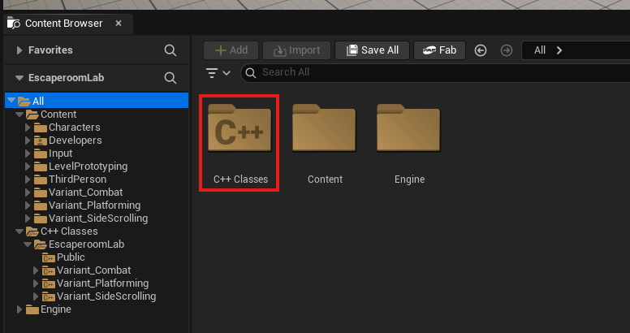
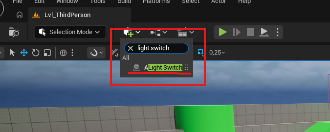
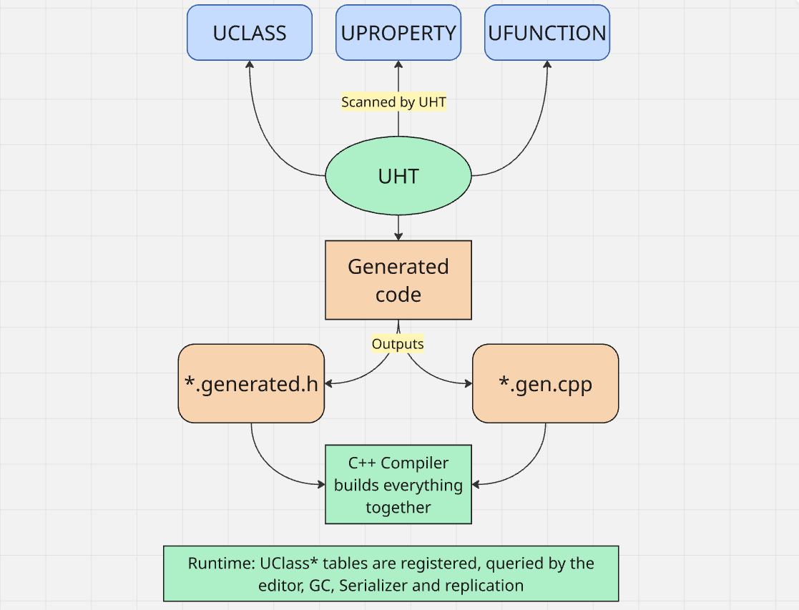
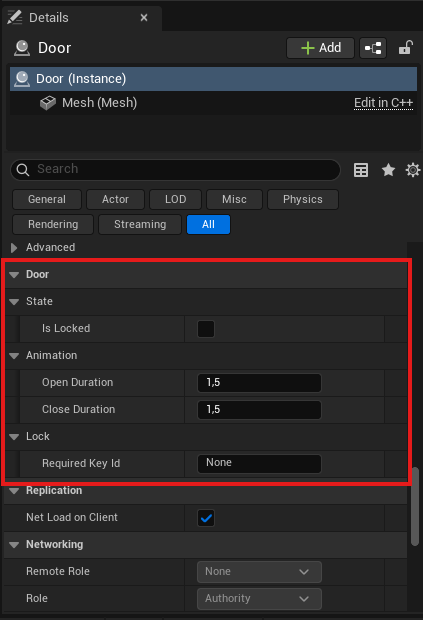
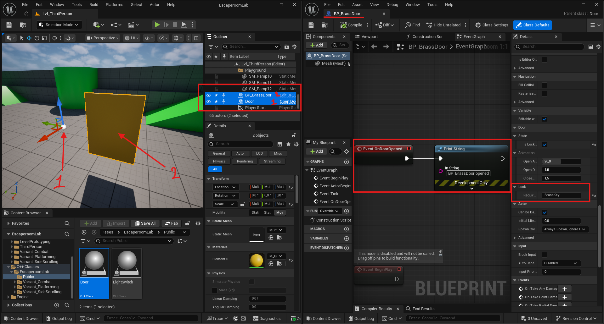

# 01 - Unreal C++ Fundamentals

You have written C++ before, in the Algorithms course with Raylib. You have used Unreal before, in the AI course with Blueprints. This block is where those two skills meet. By the end of it you should be able to create a C++ Unreal project from scratch, add new C++ classes to it, expose properties and functions to the editor and to Blueprint, and explain in plain words what the Unreal reflection system is and why it exists.

A lot of this material looks like syntax. It is not. The macros, the build system, and the memory model are the reasons Unreal C++ feels different from "normal" C++.

---

## Setup

Install these before the first session. The first hour should not be a tooling installer party.

- **Unreal Engine 5.4 or later**, installed via the Epic Games Launcher.
- **Visual Studio 2022 Community** with the *Game development with C++* workload, including the *Unreal Engine installer* component inside that workload. JetBrains Rider also works if you already have it; both will be referenced.
- **Git** with **Git LFS** initialised (`git lfs install`).
- A GitHub account.

If you are on macOS or Linux: Unreal C++ development is supported on macOS with Xcode but is materially harder to use day to day. You are welcome to use it, but I would recommend using Rider instead.

---

## Why C++ in Unreal

You might ask yourself; "I just did a Blueprint course, why would I need C++ when I can build a whole game with Blueprints only?"

Blueprints are excellent for content authoring, prototyping, and designer-facing work, the right tool for a lot of jobs.

However, they are not the right tool for tight loops, large data, complex state, or anything where you need code review, version control diffs, or to read what someone else wrote at 3am.

Every shipped Unreal title is mostly C++ at the architecture layer with Blueprints on top for content. In a studio, gameplay programmers write C++, Designers and technical artists write Blueprints.

So what makes Unreal C++ different from "normal" C++? 

Four things, which the rest of this block goes through in order:

1. **The macro system** (`UCLASS`, `UPROPERTY`, `UFUNCTION`). These are not decoration. They generate code that Unreal needs in order to know your class exists.
2. **The build system** (UnrealBuildTool, the Module system, `Build.cs` files). Unreal does not use CMake or vcpkg or anything you have seen before. It has its own build system, written in C#.
3. **The reflection system.** C++ has no built-in reflection. Unreal builds its own at compile time using the headers the macros generate. This is why you have to rebuild after adding a `UPROPERTY` and why "just edit the .cpp" does not always work.
4. **The memory model.** Unreal manages UObject lifetime with garbage collection. You do not `new` actors, you `SpawnActor`. You do not `delete` them, you `Destroy` them or let GC reap them. Raw pointers to UObjects work but require care.

---

## Your First C++ Project

Make sure you've gone through the source control setup before creating the project, the same procedure we did in the AI Programming course.

In the Epic Games Launcher, launch Unreal Engine 5. From the Project Browser, pick **Games** then **Third Person**, switch the project type from Blueprint to **C++**, and name it `EscapeRoomLab`. You will reuse this project for the whole block, so do not delete it.

When the project opens for the first time it compiles briefly. Visual Studio or Rider should launch alongside.

Open the project folder in Explorer. There are several folders and files worth knowing:

- `Source/EscapeRoomLab/` contains your C++ source.
  - `EscapeRoomLab.h` and `EscapeRoomLab.cpp` are the module entry point.
  - `EscapeRoomLab.Build.cs` is the build configuration. This file is C#, not C++.
  - `EscapeRoomLabGameMode.h/.cpp` is the generated default GameMode.
  - `EscapeRoomLabCharacter.h/.cpp` is the generated default Character.
- `Content/` contains your assets. Blueprints, meshes, textures, everything not code.
- `Config/` contains `.ini` files for project settings.
- `EscapeRoomLab.uproject` is the project descriptor.



Open `EscapeRoomLab.Build.cs` in your IDE. You will see a list called `PublicDependencyModuleNames`. This is where you declare which Unreal modules your game depends on. When you later need Enhanced Input, this is the file you add `EnhancedInput` to. This file is the most commonly forgotten cause of "unresolved external symbol" linker errors in Unreal.

---

## Adding a C++ Class

In the editor, go to **Tools > New C++ Class > Actor > Public** and name it `LightSwitch`. Unreal generates `LightSwitch.h` and `LightSwitch.cpp` in `Source/EscapeRoomLab/`.

The header looks like this:

```cpp
#pragma once

#include "CoreMinimal.h"
#include "GameFramework/Actor.h"
#include "LightSwitch.generated.h"   // MUST be last include

UCLASS()
class ESCAPEROOMLAB_API ALightSwitch : public AActor
{
    GENERATED_BODY()

public:
    ALightSwitch();

protected:
    virtual void BeginPlay() override;

public:
    virtual void Tick(float DeltaTime) override;
};
```

Several things in here are not standard C++.

**`LightSwitch.generated.h`** is generated by the Unreal Header Tool (UHT) on build. It contains the reflection metadata for your class. It must be the last `#include` in the file, and it must be present, or the build fails with a confusing error.

**`ESCAPEROOMLAB_API`** is a module export macro. It lets other modules use this class. Filled in for you, do not worry about it yet.

**The `A` prefix on `ALightSwitch`** is Unreal's naming convention. `A` for Actor subclasses, `U` for UObject subclasses, `F` for plain C++ structs, `T` for templates, `I` for interfaces, `E` for enums. Follow it. Engine code uses these consistently and so does everything you will read in the documentation.

**`GENERATED_BODY()`** is required. It expands to the boilerplate Unreal needs to make your class participate in the reflection system.

**`BeginPlay`** and **`Tick`** are virtual overrides from AActor. `BeginPlay` runs once when play starts. `Tick` runs every frame.

Once the class is generated, close the editor, build the solution in your IDE (`Ctrl+Shift+B` in Visual Studio), and reopen the project. Search "LightSwitch" in the Place Actors panel. Your class is there. You can drag it into the level. It does nothing yet. That is correct.

That is the loop: write C++, build, see it in the editor, place it in a level.



LightSwitch class appearing in the Place Actors panel

### Live Coding versus Full Build

There is a feature called Live Coding (`Ctrl+Alt+F11` with the editor open). It rebuilds and hot-patches your running editor. It works for most changes, but it breaks on `UCLASS`, `UPROPERTY`, and `UFUNCTION` changes. For those you must close the editor and do a full build. The classic mistake is adding a `UPROPERTY`, hitting Live Coding, and being confused when the property does not appear in the editor.

---

## The Reflection System

How does the Unreal editor know your `LightSwitch` class exists? How does it know to show it in the Place Actors panel? How does it know what properties to display in the Details panel?

C++ has no built-in way to ask "what fields does this class have" at runtime. You cannot iterate over a class's members in standard C++. The Unreal editor, however, needs to do this constantly: to draw the Details panel, to serialise objects to disk, to expose things to Blueprint, to support hot reload.

Unreal solves this by building its own reflection system at compile time. The pipeline looks like this:

1. You write `UCLASS()`, `UPROPERTY()`, and `UFUNCTION()` macros in your headers.
2. Before C++ compilation, the **Unreal Header Tool (UHT)** scans your headers and finds those macros.
3. UHT generates code into `*.generated.h` and `*.gen.cpp` files. This code creates metadata that describes your class (every property, every function, with full type info) and registers that metadata with the engine at startup.
4. The C++ compiler then compiles your code together with the generated code.
5. At runtime, the engine has a giant table (a `UClass*` for every reflected class) that it can query: "What properties does this class have? What are their types? What category did the programmer put them in?"

That table is what powers the Details panel, the Blueprint exposure, the serialisation system, network replication, garbage collection, everything.

This is also why:

- You must put `#include "MyClass.generated.h"` last.
- You must rebuild after adding a `UPROPERTY` (UHT must run again).
- Live Coding cannot safely hot-patch UCLASS or UPROPERTY changes (the reflection tables would have to change underneath the running editor).
- The error message "no suitable definition for `GENERATED_BODY()`" almost always means UHT did not run, or your `generated.h` include is missing or in the wrong place.



---

## UPROPERTY in Depth

`UPROPERTY` exposes a class member to the reflection system. The specifiers control what the engine and the editor can do with it. There are dozens of specifiers and you will use a handful constantly.

### Edit and visibility specifiers

These control what the editor can do with the property.

| Specifier | Editable on placed instance? | Editable on class defaults? |
| --- | --- | --- |
| `EditAnywhere` | Yes | Yes |
| `EditInstanceOnly` | Yes | No |
| `EditDefaultsOnly` | No | Yes |
| `VisibleAnywhere` | Read-only, both | Read-only, both |
| `VisibleInstanceOnly` | Read-only on instance | Hidden on defaults |
| `VisibleDefaultsOnly` | Hidden on instance | Read-only on defaults |

Rule of thumb: configuration that should differ per placed actor uses `EditAnywhere`. Tunable defaults for the class use `EditDefaultsOnly`. Things the editor should show but not let you change use `VisibleAnywhere`.

### Blueprint specifiers

| Specifier | Effect |
| --- | --- |
| `BlueprintReadWrite` | Blueprint can read and write |
| `BlueprintReadOnly` | Blueprint can read only |
| (omitted) | Blueprint cannot see it |

These combine with the edit specifiers. `UPROPERTY(EditAnywhere, BlueprintReadWrite)` is the most common form for "designer-tunable, scriptable from Blueprint".

### Categories

```cpp
UPROPERTY(EditAnywhere, BlueprintReadWrite, Category = "Door|Animation")
float OpenDuration = 1.5f;
```

The vertical bar creates a sub-category in the Details panel. Always use categories. Uncategorised properties land under a generic "Default" section that becomes a mess fast.

### Meta tags

```cpp
UPROPERTY(EditAnywhere, meta = (ClampMin = 0.0, ClampMax = 180.0, UIMin = 0.0, UIMax = 180.0))
float OpenAngle = 90.0f;
```

`ClampMin` and `ClampMax` enforce the limits in code. `UIMin` and `UIMax` set the slider range. Other meta tags worth knowing now: `(AllowPrivateAccess = "true")` to expose a `private` property to Blueprint, and `(EditCondition = "bIsLocked")` to grey out a property in the editor based on another property's value.

### What about `UPROPERTY()` with no specifiers?

It still reflects the property for **garbage collection purposes**, which matters. If you store a pointer to a UObject in a member variable and you do not mark it `UPROPERTY()`, the garbage collector does not know you are holding a reference. The object can be destroyed right from under your nose and your pointer becomes dangling.

```cpp
UPROPERTY()
TObjectPtr<USomeUObject> CachedThing;   // GC-safe

USomeUObject* RawThing;                  // NOT GC-safe, dangling pointer hazard
```

More on this below in the section on UObject lifetime.



---

## UFUNCTION in Depth

`UFUNCTION` exposes a function to the reflection system. There are two main reasons to do this:

1. **Blueprint can call your C++ function** (`BlueprintCallable`).
2. **Blueprint can implement or override your C++ function** (`BlueprintImplementableEvent`, `BlueprintNativeEvent`).

### BlueprintCallable

```cpp
UFUNCTION(BlueprintCallable, Category = "Door")
void OpenDoor();
```

C++ defines and implements it. Blueprint can call it as a graph node. This is the most common pattern. Use it for any C++ function that a Blueprint child class or Blueprint graph should be able to call.

### BlueprintPure

Same as `BlueprintCallable` but without the execution pin, for functions that just return a value with no side effects.

```cpp
UFUNCTION(BlueprintPure, Category = "Door")
bool IsLocked() const;
```

### BlueprintImplementableEvent

C++ declares it, C++ does not implement it, Blueprint implements it. C++ can call it like a normal function and the Blueprint graph runs.

```cpp
UFUNCTION(BlueprintImplementableEvent, Category = "Door")
void OnDoorOpened();   // No .cpp body. Blueprint provides it.
```

Use this when the C++ side has no useful default behaviour and you want Blueprint to drive what happens. Common for "react to event" hooks: `OnDamageTaken`, `OnInteracted`, `OnPuzzleCompleted`.

### BlueprintNativeEvent

C++ provides a default implementation, Blueprint can override it. The most flexible option.

```cpp
// .h
UFUNCTION(BlueprintNativeEvent, Category = "Door")
void OnDoorOpened();

// .cpp -- note the _Implementation suffix
void ADoor::OnDoorOpened_Implementation()
{
    UE_LOG(LogTemp, Log, TEXT("Default door opened behaviour"));
}
```

To call it from C++, you call `OnDoorOpened()` as normal. Unreal generates a stub that routes to either the C++ implementation or the Blueprint override.

### Decision guide

- "I want Blueprint to be able to call this C++ function." Use `BlueprintCallable`.
- "I want Blueprint to react to something C++ does, with no default." Use `BlueprintImplementableEvent`.
- "I want Blueprint to react to something C++ does, with a default that Blueprint can override." Use `BlueprintNativeEvent`.
- "This is internal C++, no Blueprint exposure needed." Use no UFUNCTION at all, just a regular member function.

This decision shows up dozens of times during the project. Write it down somewhere you will see it.

---

## UObject Lifetime and Garbage Collection

In normal C++, who deletes objects on the heap? You do. `delete` for `new`, smart pointers, RAII (Resource Acquisition Is Initialization). <br>C++ has no garbage collector. Memory leaks, double frees, dangling pointers are all programmer responsibilities.

In your first exercise you spawned actors with the editor's place tool.<br> When the level ends, where do they go? Who deletes them? Unreal's garbage collector.

Every UObject is GC-managed. AActors are UObjects. UActorComponents are UObjects. Almost everything you will write in this course is a UObject.

### How Unreal's GC works

Roughly every minute (the interval is configurable), Unreal walks the reflection graph and marks every UObject that is *reachable* from a known root set. Roots include the world, the GameInstance, things stored in `UPROPERTY()` member variables of reachable objects, and things explicitly added to root via `AddToRoot()`. Anything unmarked is destroyed.

The critical implication: a raw pointer to a UObject is not a reachable reference. Only `UPROPERTY()` members count.

```cpp
class AMyActor : public AActor
{
    UPROPERTY()
    TObjectPtr<AOtherActor> KnownToGC;   // GC keeps this alive while AMyActor is alive

    AOtherActor* HiddenFromGC;            // GC sees nothing here. Dangling pointer hazard.
};
```

If `HiddenFromGC` is the only pointer to its target, that target will be garbage collected and your pointer becomes dangling. This is the single most common source of late-night crashes in Unreal C++.

### TObjectPtr versus raw pointer

UE5 introduced `TObjectPtr<T>` as the preferred way to declare UObject pointers. In packaged builds it behaves identically to a raw pointer; in editor builds it does additional access tracking. Use `TObjectPtr<T>` for all new code.

```cpp
UPROPERTY()
TObjectPtr<UStaticMeshComponent> MeshComp;   // Preferred
```

### When is something deleted?

- **Actors** are destroyed when you call `Destroy()` on them, when the level unloads, or when GC reaps them (rare for actors).
- **Components** are destroyed when their owning actor is destroyed.
- **Other UObjects** are destroyed when GC determines they are unreachable.

You almost never call `delete`. You call `Destroy()` on actors. For everything else, just stop referencing it and GC handles it.

### TWeakObjectPtr

For when you want to hold a reference but not prevent GC.

```cpp
UPROPERTY()
TWeakObjectPtr<AActor> LastSeenTarget;   // Will not keep the target alive
```

Useful for "the last actor I saw" caches where you do not want to extend an actor's lifetime just because you remembered it. Always check `.IsValid()` before using.

---

## Spawning and Destroying Actors

How you bring actors into the world from code.

```cpp
FActorSpawnParameters Params;
Params.SpawnCollisionHandlingOverride = ESpawnActorCollisionHandlingMethod::AlwaysSpawn;

ADoor* NewDoor = GetWorld()->SpawnActor<ADoor>(
    ADoor::StaticClass(),
    FVector(100.0f, 0.0f, 0.0f),
    FRotator::ZeroRotator,
    Params
);

if (NewDoor)
{
    NewDoor->SetActorScale3D(FVector(2.0f));
}
```

Several points worth noting:

- `GetWorld()` is available on every Actor. UObjects that are not actors need a world passed in.
- `ADoor::StaticClass()` returns the `UClass` of `ADoor`. Reflection again.
- `SpawnActor` returns the spawned actor or `nullptr` if spawning failed (collision, level not ready, and so on). Always null-check the result.

To spawn a Blueprint class from C++ (the common case in production):

```cpp
UPROPERTY(EditDefaultsOnly, Category = "Spawning")
TSubclassOf<ADoor> DoorClassToSpawn;

// later
ADoor* NewDoor = GetWorld()->SpawnActor<ADoor>(DoorClassToSpawn, Location, Rotation);
```

`TSubclassOf<ADoor>` is a `UPROPERTY`-friendly way to hold "a class that is either ADoor or a subclass of ADoor". In the editor it shows as a class picker filtered to ADoor and its children. This is how you let designers pick "which kind of door to spawn" from Blueprint while keeping the spawning logic in C++.

To destroy an actor:

```cpp
SomeActor->Destroy();
```

It is removed from the world, marked pending kill, and GC cleans it up shortly afterwards. After `Destroy()`, do not access the actor.

---

## Unreal's Containers

Unreal has its own container library. The reasons are historical (Unreal predates the STL stabilising), practical (Unreal's containers integrate with reflection and serialisation), and engineering (they have purpose-built debugger visualisers and are sometimes faster).

The rule for this course: use Unreal containers, not std containers, for anything that interacts with reflection, gets serialised, or is stored in a `UPROPERTY`. For local computation inside a function, either is fine.

### TArray

The dynamic array. Like `std::vector`.

```cpp
TArray<AActor*> NearbyActors;

NearbyActors.Add(SomeActor);
NearbyActors.Remove(SomeActor);
NearbyActors.RemoveAt(0);
NearbyActors.Num();          // size
NearbyActors.Contains(X);
NearbyActors.IsEmpty();
NearbyActors.Empty();        // clear

for (AActor* Actor : NearbyActors)
{
    // range-based for loop works
}

if (NearbyActors.IsValidIndex(0))
{
    AActor* First = NearbyActors[0];
}
```

`TArray` is `UPROPERTY`-friendly and serialises correctly:

```cpp
UPROPERTY(EditAnywhere)
TArray<TSubclassOf<ADoor>> DoorVariants;
```

### TMap

Key-value dictionary. Like `std::unordered_map`.

```cpp
TMap<FName, int32> KeyCounts;

KeyCounts.Add("BrassKey", 3);
KeyCounts.Add("IronKey", 1);

int32* CountPtr = KeyCounts.Find("BrassKey");
if (CountPtr)
{
    *CountPtr += 1;
}

if (KeyCounts.Contains("IronKey"))
{
    int32 Count = KeyCounts["IronKey"];
}
```

`Find` returns a pointer to the value, not the value itself. `nullptr` if the key is missing. Using `[]` on a non-existent key will assert in debug; use `Find` for safe lookup.

`TMap` is also `UPROPERTY`-friendly:

```cpp
UPROPERTY(EditAnywhere)
TMap<FName, int32> DefaultInventory;
```

In the editor it shows as a list of key/value pairs you can edit. Useful for designer-tunable data.

### TSet

A hash set. Like `std::unordered_set`. Used less often than `TArray` and `TMap`, but useful when you need fast "does this collection contain X?" lookups without a value.

### Why not std?

- `std::vector` and friends do not reflect, so they cannot be a `UPROPERTY`.
- `std::string` does not reflect, so it will not appear in the editor, will not serialise, and will not replicate.
- Debuggers inside Unreal have purpose-built visualisers for `TArray`, `TMap`, `FString`, and friends. STL types show as a blob of internal members.

For a local computation in a function body that never escapes, you can use std types. The moment the data needs to leave the function or be visible to the engine, it must be Unreal types.

---

## Strings

Unreal has three string types and they are not interchangeable.

| Type | Use for | Performance |
| --- | --- | --- |
| `FString` | Mutable, dynamic strings. Building, concatenating, logging. | Heap-allocated. Slow comparisons. |
| `FName` | Identifiers. Asset names, tags, Blueprint node names. Case-insensitive, immutable. | Interned. Comparison is integer-fast. |
| `FText` | User-facing, localisable text. UI labels, dialogue. | Heaviest. Use only when localisation matters. |

Rule of thumb:

- "I am building a string at runtime to print or save." Use `FString`.
- "This is a name or ID that I will compare against other names." Use `FName`.
- "This will be displayed to the user and might need translating." Use `FText`.

```cpp
// FString
FString Greeting = TEXT("Hello");
Greeting += TEXT(", world");
FString Combined = FString::Printf(TEXT("Player %s scored %d"), *PlayerName, Score);
UE_LOG(LogTemp, Log, TEXT("%s"), *Combined);   // note the * to convert FString to TCHAR*

// FName
FName KeyType = TEXT("BrassKey");
if (KeyType == TEXT("BrassKey")) { /* fast */ }

// FText
FText Label = NSLOCTEXT("DoorUI", "OpenPrompt", "Press E to open");
```

The `TEXT()` macro is required around string literals so they compile correctly in both ANSI and Unicode builds. Always use it.

A simple test for which type a member variable should be: if you would compare it with `==`, it is probably an `FName`. If you would build it with `Printf`, it is probably an `FString`. If a player would read it, it is probably an `FText`.

---

## A Worked Example: The Door

The block ends with one piece of code you should build yourself. It is a small thing but it integrates everything covered so far: a `UCLASS` with `UPROPERTY` members of different types, a `UFUNCTION` for Blueprint to call, a `BlueprintImplementableEvent` for Blueprint to react to, and a `TArray` and `FName` used together.

Build a `Door` actor with the following:

- A `UStaticMeshComponent` for the visible mesh.
- A `bool bIsLocked`, `EditAnywhere`, `BlueprintReadWrite`, default `false`.
- A `float OpenAngle`, `EditDefaultsOnly`, with `ClampMin = 0` and `ClampMax = 180`, default 90.
- A `float OpenDuration`, `EditAnywhere`, `BlueprintReadWrite`, default 1.5.
- A `FName RequiredKeyId`, `EditAnywhere`. Empty means no key needed.
- A `TArray<FName> KeysHeld`. For testing, populate it with one key in `BeginPlay`.
- A `BlueprintCallable bool TryOpen()` function that returns `true` and logs "Door opened" if `RequiredKeyId` is empty or is present in `KeysHeld`, and returns `false` otherwise.
- A `BlueprintImplementableEvent void OnDoorOpened()` that `TryOpen()` calls on success.

Create a Blueprint child of your C++ `ADoor` class and place that in the level. Implement `OnDoorOpened` in the Blueprint graph to print a string or play a sound. This is the C++ and Blueprint interop pattern the entire project will use: behaviour and architecture in C++, content and tuning in Blueprint.

Image shows two placed actors, the C++ version without a mesh and a BP version with added mesh and event graph calling the `OnDoorOpened` event.



---

## What to Have Working by End of Block

- A C++ Unreal project on disk, building cleanly, pushed to a GitHub repository with Git LFS configured.
- At least one C++ Actor class you wrote yourself, placed in a level.
- The `Door` worked example or your own equivalent, with at least one Blueprint child of a C++ class.

---

### Commit!

Don't forget to commit after each meaningful addition to the project.

Remember:

```
git add .
git commit -m "Project setup, Door worked example"
git push
```