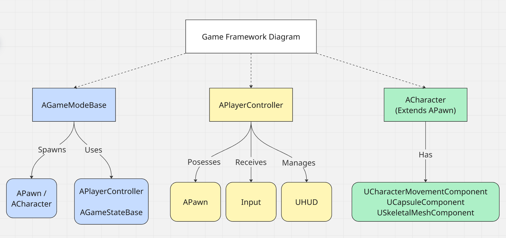

# 02 - Actor Architecture

In block 01 you created a C++ class, added `UPROPERTY` and `UFUNCTION` macros, and built the Door worked example. You know what the reflection system is and why it exists.

This block goes one level deeper: how Unreal's Actor and Component architecture is actually structured, how the game framework connects everything together, how to write clean input handling with Enhanced Input, and how to build a proper Interaction System that will serve as the backbone of the escape room project.

By the end of this block you should be able to set up the full game framework hierarchy in C++ (GameMode, GameState, PlayerController, Pawn), handle player input correctly using the Enhanced Input system, build a component-based interaction architecture, and explain what the difference between a Pawn and a Character is and when to use each.

---

## The Game Framework

Unreal has a set of built-in classes that form the backbone of every game. These are not optional. They exist in every project and you interact with them whether you know it or not. Knowing what each one does and which one to put your code in is one of the clearest signals of Unreal experience in a technical interview.



### AGameModeBase and AGameMode

`AGameModeBase` is the authority for the rules of the game. It only exists on the server (in multiplayer) or as a single instance (in singleplayer). It is never replicated to clients.

It is responsible for:

- Which Pawn class to spawn for players when they join.
- Which PlayerController class to use.
- Which HUD class to use.
- Win, lose, and restart conditions.
- Starting and ending the match.

`AGameMode` extends `AGameModeBase` with a match state machine (`WaitingToStart`, `InProgress`, `WaitingPostMatch`, `LeavingMap`). For a simple single-player escape room you can subclass either; `AGameModeBase` is simpler.

```cpp
UCLASS()
class ESCAPEROOMLAB_API AEscapeRoomGameMode : public AGameModeBase
{
    GENERATED_BODY()

public:
    AEscapeRoomGameMode();

    // Called when the player solves the final puzzle.
    void OnEscapeComplete();
};
```

You set the active GameMode per level in **Project Settings > Maps & Modes** or in the level's **World Settings**. This is how you could have a menu level use a simple GameMode and the game level use your escape room GameMode.

### AGameStateBase

`AGameState` holds data that all players need to know about: elapsed time, score, puzzle state, doors unlocked. Unlike GameMode (server-only), GameState is replicated to all clients. For a single-player game the distinction does not matter yet, but putting shareable state here is the correct architectural habit.

### APlayerController

One `APlayerController` per player. It represents the player's intent. Think of it as the wire between the human at the keyboard and the Pawn in the world.

The PlayerController:

- Processes raw input and converts it to actions (or delegates to Enhanced Input, as we will do).
- Stores data that persists across Pawn deaths (because the Pawn can be destroyed and respawned, but the PlayerController lives on).
- Handles the camera rotation in some game types.
- Is the right place for UI management (`CreateWidget`, `AddToViewport`).

Important: a Pawn does not directly handle input. The PlayerController does, then tells the Pawn what to do. This separation matters once you have multiple pawns a player can possess.

### APawn and ACharacter

A `APawn` is any actor that can be possessed by a Controller. The ThirdPerson template you created in block 01 uses `ACharacter`, which is a Pawn subclass with a built-in `UCharacterMovementComponent` that handles walking, jumping, crouching, falling, swimming, and flying with physically plausible movement.

When to use which:

- **ACharacter**: bipedal humanoid with standard movement. Use this for your player and most NPCs.
- **APawn**: anything that needs to be possessed but does not walk like a human. Vehicles, floating drones, turrets. You implement your own movement.
- **AActor**: anything that is never possessed and never moves under its own control (doors, props, pickups).

Your escape room player is an `ACharacter`. Your Door, KeyPickup, and Puzzle actors are `AActor` subclasses.

### APlayerState

Stores per-player data that persists across respawns and is replicated: player name, score, ready state. Less relevant for single-player but good to know. If you add multiplayer to the escape room later, collected keys and solved puzzles belong in PlayerState.

### AHUD

The HUD is a single actor the PlayerController spawns. It is the old way to draw UI; modern Unreal uses UMG Widget Blueprints instead. You will create your UI with UMG, but the HUD class still exists and is still where you hold references to your in-world overlay widgets.

---

## Enhanced Input

The old input system (Axis Mappings and Action Mappings in project settings) is deprecated. Enhanced Input replaces it with two assets:

- **Input Action** (`UInputAction`): represents a single logical action. `IA_Move`, `IA_Look`, `IA_Interact`, `IA_Jump`. Each action has a value type (`bool` for pressed/released, `float` for 1D, `FVector2D` for 2D axes, `FVector` for 3D).
- **Input Mapping Context** (`UInputMappingContext`): maps physical inputs (keys, gamepad buttons, mouse axes) to Input Actions, with modifiers and triggers.

The separation is the key insight: your code binds to `IA_Move`, not to `W`, `S`, `A`, `D`. The Mapping Context handles which physical keys produce `IA_Move`. You can swap Mapping Contexts at runtime (menu vs gameplay, driving vs on foot) without touching gameplay code.

### Setting up Enhanced Input in C++

First, add `EnhancedInput` to your `Build.cs`:

```cpp
PublicDependencyModuleNames.AddRange(new string[]
{
    "Core", "CoreUObject", "Engine", "InputCore", "EnhancedInput"
});
```

Create your Input Actions as assets in the Content Browser (`Input > Input Action`). Set the value type. Do this for `IA_Move` (Axis2D), `IA_Look` (Axis2D), `IA_Jump` (Digital), `IA_Interact` (Digital).

Create an Input Mapping Context (`Input > Input Mapping Context`). Add mappings: `IA_Move` → W (with Swizzle Input Axis Values modifier to push to Y), S (with Negate and Swizzle), A (Negate), D. `IA_Look` → Mouse XY 2D Axis. `IA_Jump` → Space Bar. `IA_Interact` → E.

In your Character header, expose references to these assets:

```cpp
#include "InputMappingContext.h"
#include "InputAction.h"

UCLASS()
class ESCAPEROOMLAB_API AEscapeRoomCharacter : public ACharacter
{
    GENERATED_BODY()

public:
    AEscapeRoomCharacter();

protected:
    virtual void BeginPlay() override;
    virtual void SetupPlayerInputComponent(UInputComponent* PlayerInputComponent) override;

private:
    UPROPERTY(EditDefaultsOnly, Category = "Input")
    TObjectPtr<UInputMappingContext> DefaultMappingContext;

    UPROPERTY(EditDefaultsOnly, Category = "Input")
    TObjectPtr<UInputAction> MoveAction;

    UPROPERTY(EditDefaultsOnly, Category = "Input")
    TObjectPtr<UInputAction> LookAction;

    UPROPERTY(EditDefaultsOnly, Category = "Input")
    TObjectPtr<UInputAction> JumpAction;

    UPROPERTY(EditDefaultsOnly, Category = "Input")
    TObjectPtr<UInputAction> InteractAction;

    void Move(const FInputActionValue& Value);
    void Look(const FInputActionValue& Value);
    void Interact();
};
```

In the cpp:

```cpp
#include "EnhancedInputComponent.h"
#include "EnhancedInputSubsystems.h"
#include "InputActionValue.h"

void AEscapeRoomCharacter::BeginPlay()
{
    Super::BeginPlay();

    if (APlayerController* PC = Cast<APlayerController>(GetController()))
    {
        if (UEnhancedInputLocalPlayerSubsystem* Subsystem =
            ULocalPlayer::GetSubsystem<UEnhancedInputLocalPlayerSubsystem>(PC->GetLocalPlayer()))
        {
            Subsystem->AddMappingContext(DefaultMappingContext, 0);
        }
    }
}

void AEscapeRoomCharacter::SetupPlayerInputComponent(UInputComponent* PlayerInputComponent)
{
    if (UEnhancedInputComponent* EIC = Cast<UEnhancedInputComponent>(PlayerInputComponent))
    {
        EIC->BindAction(MoveAction,     ETriggerEvent::Triggered, this, &AEscapeRoomCharacter::Move);
        EIC->BindAction(LookAction,     ETriggerEvent::Triggered, this, &AEscapeRoomCharacter::Look);
        EIC->BindAction(JumpAction,     ETriggerEvent::Started,   this, &ACharacter::Jump);
        EIC->BindAction(JumpAction,     ETriggerEvent::Completed, this, &ACharacter::StopJumping);
        EIC->BindAction(InteractAction, ETriggerEvent::Started,   this, &AEscapeRoomCharacter::Interact);
    }
}

void AEscapeRoomCharacter::Move(const FInputActionValue& Value)
{
    FVector2D Axis = Value.Get<FVector2D>();
    if (Controller)
    {
        const FRotator Rotation = Controller->GetControlRotation();
        const FRotator YawRotation(0, Rotation.Yaw, 0);
        const FVector Forward = FRotationMatrix(YawRotation).GetUnitAxis(EAxis::X);
        const FVector Right   = FRotationMatrix(YawRotation).GetUnitAxis(EAxis::Y);
        AddMovementInput(Forward, Axis.Y);
        AddMovementInput(Right,   Axis.X);
    }
}

void AEscapeRoomCharacter::Look(const FInputActionValue& Value)
{
    FVector2D Axis = Value.Get<FVector2D>();
    AddControllerYawInput(Axis.X);
    AddControllerPitchInput(Axis.Y);
}

void AEscapeRoomCharacter::Interact()
{
    // Filled in below.
}
```

The `ETriggerEvent` enum controls when the binding fires:

| ETriggerEvent | When |
| --- | --- |
| `Started` | First frame the input condition is met |
| `Triggered` | Every frame while active (held) |
| `Completed` | First frame the input condition ends |
| `Canceled` | Condition interrupted before completing |

`Jump` uses `Started` (begin jump on press) and `Completed` (stop holding on release). `Move` uses `Triggered` (run every frame while keys held). `Interact` uses `Started` (fire once on press).

---

## The Component Pattern

A door that opens when pressed is simple. A door that opens when pressed, is locked until a key is collected, plays an animation, and triggers a sound is not. If you put all of that in `ADoor`, the class becomes hard to read and impossible to reuse.

The component pattern is the solution Unreal is designed around. Behaviour that might apply to more than one type of object goes in a component. The Actor composes itself from components.

For the escape room, this yields a reusable `UInteractableComponent`:

- Any actor that has an `UInteractableComponent` can be interacted with.
- The component defines what happens on interact (via a delegate the owning actor listens to).
- The player does not need to know anything about `ADoor`, `AKeyPickup`, or `APuzzleButton`. It just detects `UInteractableComponent` and calls `Interact()`.

### Building UInteractableComponent

```cpp
// InteractableComponent.h
#pragma once

#include "CoreMinimal.h"
#include "Components/ActorComponent.h"
#include "InteractableComponent.generated.h"

DECLARE_DYNAMIC_MULTICAST_DELEGATE_OneParam(FOnInteracted, AActor*, Interactor);

UCLASS(ClassGroup = "EscapeRoom", meta = (BlueprintSpawnableComponent))
class ESCAPEROOMLAB_API UInteractableComponent : public UActorComponent
{
    GENERATED_BODY()

public:
    UInteractableComponent();

    UFUNCTION(BlueprintCallable, Category = "Interaction")
    void Interact(AActor* Interactor);

    UPROPERTY(BlueprintAssignable, Category = "Interaction")
    FOnInteracted OnInteracted;

    UPROPERTY(EditAnywhere, BlueprintReadWrite, Category = "Interaction")
    FText InteractPrompt;

    UPROPERTY(EditAnywhere, BlueprintReadWrite, Category = "Interaction")
    bool bIsEnabled = true;
};
```

```cpp
// InteractableComponent.cpp
#include "InteractableComponent.h"

UInteractableComponent::UInteractableComponent()
{
    PrimaryComponentTick.bCanEverTick = false;
}

void UInteractableComponent::Interact(AActor* Interactor)
{
    if (!bIsEnabled) return;
    OnInteracted.Broadcast(Interactor);
}
```

`DECLARE_DYNAMIC_MULTICAST_DELEGATE_OneParam` generates a delegate type that:

- Supports multiple bindings (multicast).
- Works with Blueprint (`DYNAMIC`).
- Passes one parameter (the interacting actor).

`BlueprintAssignable` on the delegate property means Blueprint can bind to it in the event graph, exactly like a built-in event. This is how the Door's Blueprint graph can react to `OnInteracted` without the door having any knowledge of the component internals.

### The Door uses the component

```cpp
// Door.h
UCLASS()
class ESCAPEROOMLAB_API ADoor : public AActor
{
    GENERATED_BODY()

public:
    ADoor();

protected:
    virtual void BeginPlay() override;

private:
    UPROPERTY(VisibleAnywhere)
    TObjectPtr<UStaticMeshComponent> MeshComp;

    UPROPERTY(VisibleAnywhere)
    TObjectPtr<UInteractableComponent> InteractableComp;

    UPROPERTY(EditAnywhere, Category = "Door")
    float OpenAngle = 90.0f;

    UPROPERTY(EditAnywhere, Category = "Door")
    float OpenDuration = 1.5f;

    UPROPERTY(EditAnywhere, Category = "Door")
    bool bIsLocked = false;

    bool bIsOpen = false;

    UFUNCTION()
    void OnInteracted(AActor* Interactor);

    void Open();
};
```

```cpp
// Door.cpp
ADoor::ADoor()
{
    MeshComp = CreateDefaultSubobject<UStaticMeshComponent>(TEXT("MeshComp"));
    RootComponent = MeshComp;

    InteractableComp = CreateDefaultSubobject<UInteractableComponent>(TEXT("InteractableComp"));
}

void ADoor::BeginPlay()
{
    Super::BeginPlay();
    InteractableComp->OnInteracted.AddDynamic(this, &ADoor::OnInteracted);
    InteractableComp->InteractPrompt = FText::FromString(bIsLocked ? TEXT("Locked") : TEXT("Open Door"));
}

void ADoor::OnInteracted(AActor* Interactor)
{
    if (bIsLocked || bIsOpen) return;
    Open();
}

void ADoor::Open()
{
    bIsOpen = true;
    // Timeline or latent action to rotate mesh over OpenDuration.
    UE_LOG(LogTemp, Log, TEXT("Door opened."));
}
```

`CreateDefaultSubobject<T>` creates a component in the constructor and attaches it to the Actor. The string argument is the component's internal name (must be unique per actor). This is the only place you create components. Do not create them in `BeginPlay`.

`AddDynamic` binds a UFUNCTION to a delegate. The function must be marked `UFUNCTION()` even if it has no specifiers. This is a common mistake that causes silent runtime failures.

### The Character detects and calls the component

The player does a line trace from the camera forward each frame, looks for `UInteractableComponent` on whatever it hits, and stores a reference.

```cpp
void AEscapeRoomCharacter::Tick(float DeltaTime)
{
    Super::Tick(DeltaTime);

    FocusedInteractable = nullptr;

    // First person line trace:
    FVector Start = FollowCamera->GetComponentLocation();
    FVector End   = Start + FollowCamera->GetForwardVector() * InteractRange;

    // Third person line trace:
    // FVector Start = GetActorLocation() + FVector(0, 0, BaseEyeHeight);
    // FVector End   = Start + GetActorForwardVector() * InteractRange;
    
    // Optional debug draw line:
    // DrawDebugLine(GetWorld(), Start, End, FColor::Green, false, -1.0f, 0, 1.0f);

    FHitResult Hit;
    FCollisionQueryParams Params;
    Params.AddIgnoredActor(this);

    if (GetWorld()->LineTraceSingleByChannel(Hit, Start, End, ECC_Visibility, Params))
    {
        if (AActor* HitActor = Hit.GetActor())
        {
            FocusedInteractable = HitActor->FindComponentByClass<UInteractableComponent>();
        }
    }
}

void AEscapeRoomCharacter::Interact()
{
    if (FocusedInteractable && FocusedInteractable->bIsEnabled)
    {
        FocusedInteractable->Interact(this);
    }
}
```

`FindComponentByClass<T>` is the reflection system at work. At runtime it queries the actor's component list for a component of type `T`. This is how the player can interact with any actor that has the component without having a direct reference to it or knowing its class. The player just knows: "did the thing I hit have an `UInteractableComponent`?"

---

## Delegates in Depth

Delegates are Unreal's event callback system. You have already used one above. Understanding them properly is necessary for writing clean C++ in Unreal.

### Types

| Macro | Supports multiple bindings | Blueprint bindable | Use when |
| --- | --- | --- | --- |
| `DECLARE_DELEGATE` | No (single-cast) | No | Internal C++ callbacks |
| `DECLARE_MULTICAST_DELEGATE` | Yes | No | C++ event that multiple systems observe |
| `DECLARE_DYNAMIC_DELEGATE` | No | Yes | Blueprint-facing single callback |
| `DECLARE_DYNAMIC_MULTICAST_DELEGATE` | Yes | Yes | Blueprint-facing event (most common) |

Parameters are added to the macro name: `_OneParam`, `_TwoParams`, etc. Each parameter needs a type and a name.

```cpp
DECLARE_DYNAMIC_MULTICAST_DELEGATE_TwoParams(FOnKeyCollected, AActor*, Collector, FName, KeyId);
```

### Binding

For `DYNAMIC` delegates (Blueprint-compatible), bind with `AddDynamic`. The callback must be a `UFUNCTION`.

For non-dynamic delegates, bind with `AddUObject`, `AddLambda`, or `AddRaw`.

```cpp
// Dynamic (UFUNCTION required on callback)
MyDelegate.AddDynamic(this, &AMyActor::OnSomethingHappened);

// Non-dynamic (lambda works)
MyDelegate.AddLambda([this]()
{
    UE_LOG(LogTemp, Log, TEXT("Something happened"));
});
```

### Broadcast and Execute

```cpp
// Multicast - notifies all bound callbacks
MyMulticastDelegate.Broadcast(SomeActor, TEXT("BrassKey"));

// Single-cast - calls the one bound callback, asserts if nothing bound
MySingleDelegate.Execute();

// Single-cast - calls if bound, no-ops if not
MySingleDelegate.ExecuteIfBound();
```

Always use `ExecuteIfBound` rather than `Execute` unless you are certain a binding exists. The assert from `Execute` on an unbound delegate is a common source of confusing crashes.

### Removing bindings

```cpp
MyDelegate.RemoveDynamic(this, &AMyActor::OnSomethingHappened);
MyDelegate.Clear();   // remove all bindings
```

Components and actors are destroyed during level unload while the delegate might still hold a binding to them. Always remove your bindings in `EndPlay` or `BeginDestroy` if the object lifetime is uncertain.

---

## Component Lifecycle

Components have the same lifecycle events as Actors, but a few are worth calling out specifically.

### Constructor vs BeginPlay

`CreateDefaultSubobject` must be called in the constructor. The Actor's component hierarchy is assembled during construction before the editor or the world has touched it. `BeginPlay` runs after the actor is fully placed and the level has started.

Never create a component in `BeginPlay`. Never use `GetWorld()` in the constructor.

### TickComponent

Components can tick independently.

```cpp
PrimaryComponentTick.bCanEverTick = true;    // in constructor
PrimaryComponentTick.bStartWithTickEnabled = false;  // off by default, enabled when needed
```

Ticking has a cost. Most components do not need to tick every frame. Use `SetComponentTickEnabled(true/false)` to turn ticking on and off at runtime rather than always ticking and branching.

### OnRegister and InitializeComponent

`OnRegister` is called when the component is registered with the world (before `BeginPlay`). Useful for setting up editor preview behaviour.

`InitializeComponent` is called after `BeginPlay` if `bWantsInitializeComponent` is true. Useful for components that need to initialise from their owning actor's state after the actor is fully set up.

---

## TSubclassOf and Object Libraries

In block 01 you used `TSubclassOf<T>` to let a designer pick a class. This is the right pattern for spawning. Combined with a `TArray<TSubclassOf<ADoor>>` you can give designers a list of door variants to randomise from.

An extension of this: `UObjectLibrary` lets you scan a folder in the Content Browser at runtime and load all assets of a given class. Useful once the project grows and you have twenty key variants:

```cpp
UObjectLibrary* Library = UObjectLibrary::CreateLibrary(ADoor::StaticClass(), true, false);
Library->LoadBlueprintAssetDataFromPath(TEXT("/Game/Doors"));
// Then iterate Library->GetAssetDataList() to build a TArray of classes.
```

This is not required for the project but is mentioned here because it becomes relevant in production very quickly.

---

## What to Have Working by End of Block

- A custom `AGameMode` set as the default for the escape room level.
- Enhanced Input configured: `IA_Move`, `IA_Look`, `IA_Jump`, `IA_Interact` wired up correctly. Player moves and looks using Enhanced Input, not the old Axis Mapping system.
- `UInteractableComponent` implemented and added to `ADoor`.
- Player can walk up to the door, and pressing E calls `Interact()` on the component.
- `ADoor::OnInteracted` bound via `AddDynamic`, logs to the output when triggered.
- All of the above pushed to your GitHub repository.

The Door does not need to visually animate yet. That comes in block 03 when you cover timelines and procedural animation. What matters now is that the architecture is in place: the right code is in the right class, the component is on the actor, the delegate is broadcasting, and the player is responding.
